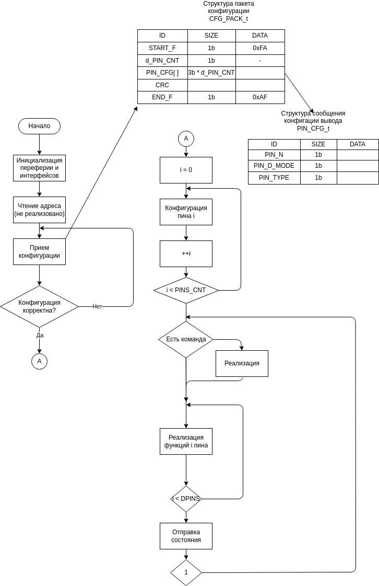
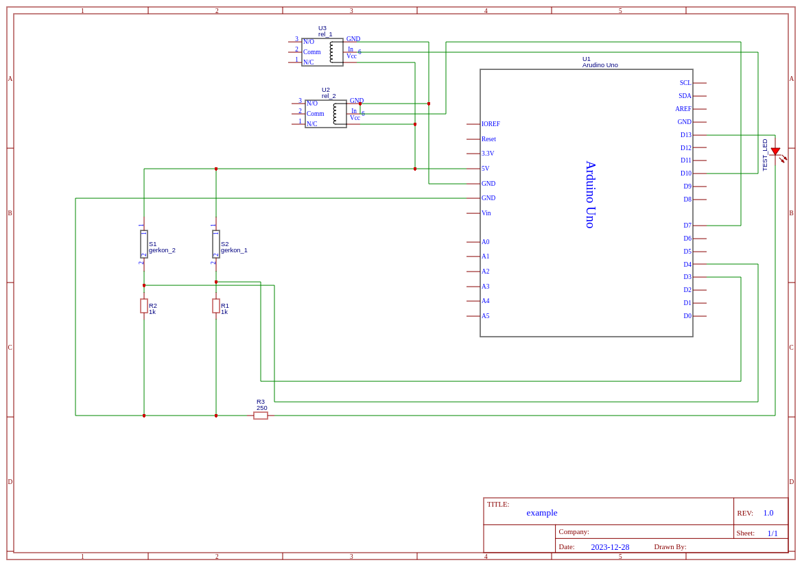

# PYINOAPI
Для взаимодействия и автоматической конфигурации контроллеров
> [!WARNING]
> Нужно ещё сделать CRC-8, и работу по RS-485 (мне не пришли пока драйверы)
## Структура проекта

- arduino: Код для Arduino MEGA, включая конфигурацию и логику управления объектами.
- pyInoApi: Апи для взаимодействия с контроллером
- cfg: Файлы конфигурации

## Установка и настройка

- Arduino MEGA: Загрузите код из папки Arduino на Arduino MEGA с помощью Arduino IDE.
- Для теста запустите example.py

## Конфигурация игр
- Игры конфигурируются с использованием JSON-файлов в папке cfg.

## Алгоритм  (API)
Каждый тик после конфигурации происходит опрос контроллера. Он выдает полное состояние своих входов и выходов (в соответсвии с конфигурацией). Например конфигурация вывода как реле выгялдит следующим образом:
```json
    {
        "pinType": "digital",
        "pinID": "7",
        "pinMode": "write",
        "pinName": "rel_2"
    },
```
Т.е. на седьмом пине контроллера у нас висит реле, которым мы управляем. Дальше в основном цикле мы можем изменить состояние этого реле:
```python
    brd = Brd(path_to_cfg_board)
    brd.configure()
    brd.change("rel_2", 1)
    brd.change("rel_2", 0)
```
Предположим, что у нас есть геркон состояние которого нужно читать для этого следует добавить в конфигурацию следующий пин:
```json
{
    "pinType": "digital",
    "pinID": "7",
    "pinMode": "read",
    "pinName": "gerkon_1"
},
```
И теперь мы так же можем читать его состояние и делать логику:
```python
    brd = Brd(path_to_cfg_board)
    brd.configure()
    if brd.check("gerkon_1") and not brd.check("rel_2"):
        brd.change("rel_2", 1)
    else:
        brd.change("rel_2", 0)
```

## Алгоритм  (Arduino)



## Пример
В данном примере у нас простая комната с двумя реле и двумя дверьми. Как только открывается первая дверь, включается реле, как только открывается вторая, включатется второе реле и светодиод.
```python
brd = Brd(cfg.brds_cfg["boards"][0])
brd.configurate()
print(f"ПЛАТА: {brd.type} {brd.id} сконфигурировна")
while 1:
    # Основной цикл
    # Тут стадии игр обращение к БД, да в принципе что угодно
    brd.get_state()  # Каждый тик мы обновляем состояние контроллера
    # Теперь можно отреагировать на воздействия
    while 1:
        # Основной цикл
        # Тут стадии игр обращение к БД, да в принципе что угодно
        brd.get_state()  # Каждый тик мы обновляем состояние контроллера
        # Теперь можно отреагировать на воздействия
        if not brd.check("gerkon_1"):
            # И дать управляющие воздействия
            brd.change("rel_1", 1)
        else:
            brd.change("rel_1", 0)
        if not brd.check("gerkon_2"):
            brd.change("rel_2", 1)
            brd.change("test_led", 1)
        else:
            brd.change("rel_2", 0)
            brd.change("test_led", 0)
```

## Схема подключения примера

